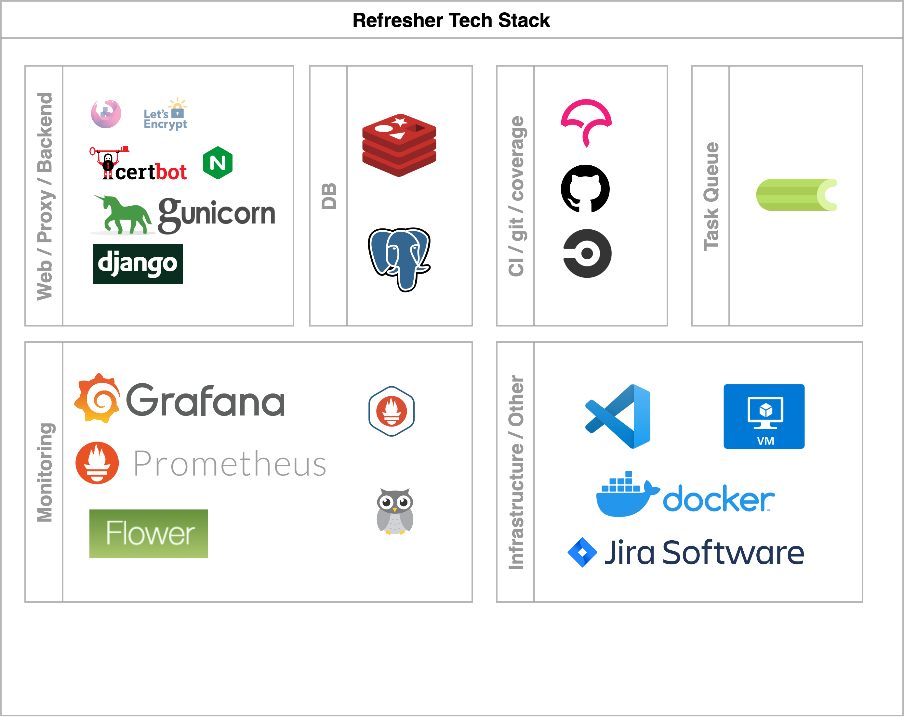

# refresher

[](https://github.com/ibrahimroshdy/refresher/actions/workflows/docker-image.yml)
[](https://codecov.io/gh/ibrahimroshdy/refresher)
```
           __               _               
 _ __ ___ / _|_ __ ___  ___| |__   ___ _ __ 
| '__/ _ \ |_| '__/ _ \/ __| '_ \ / _ \ '__|
| | |  __/  _| | |  __/\__ \ | | |  __/ |   
|_|  \___|_| |_|  \___||___/_| |_|\___|_|   

        ├── README.md
        ├── apps
        ├── config
        ├── docker
        ├── manage.py
        ├── nginx
        ├── pyproject.toml
        ├── requirements.txt
        ├── scripts
        ├── static
        ├── staticfiles
        └── templates
```

## Introduction
### Refresher Project 
Refresher project is a complete infrastcture that embodies different technologies to serve series of tasks. 
The refresher project aims to create a complete guide in every aspect of those technologies
to serve as a guide or a template for jumpstarting similar projects. 
There is basically no definitive aim for this project rather than having an educational pipeline that is so complex yet so simple to 
understand in introductin how to develop, stage, relese and maintain projects. 

>#### Refresher Usecase
>Imagine you need a cronjob (schdulded) based application that excutes specific tasks at specific intervals of your 
choice **and** stores information regarding these tasks (output, logs..etc). Moreover, you need to monitor these 
tasks in terms of successes and failures. You also need to monitor your system usage, database usage and your docker services (containers) health. 
Finally, you need visualize all of these, rather than looking at tens of scrambled data in tables, quries on your console.
> After all that, you need to serve your application(s) pubically and securely. 


### Tech Stack 
In this section, the referesher project's tech stack is visulaized and explained. 
The tech stack is a chart with all the components and tools used to build this project and
not just technical tools but also project management tools, Continous Integration (CI), code coverage as well. 



### Architecture
The refresher project V1 runs on a single host machine (virtual machine) to simplyfiy the architecture visulaization. 
Running on Azure Compute Virtual Machine and using Docker to run containers. 
In V2 and onwards, refresher project will change its architecture as the project grows.
`Refresher V1` is a monolitical single host project using dockerized containers sharing the same network to serve different purposes. 
`There are so many wrongs here but for a starter pack option this can be considred.`


> Well, let's break this down. The refresher project has single subdomain attached to it which is `speedtester.withnoedge.tech`

The [SWAG](https://www.linuxserver.io/blog/2020-08-21-introducing-swag) - Secure Web Application Gateway - 
is an tool that encapulates tools that are essential for running a secure web application, as it says 
'sets up an Nginx webserver and reverse proxy with php support and a 
built-in certbot client that automates free SSL server certificate generation and renewal processes'
SWAG has:
1. [Certbot](https://certbot.eff.org/)
2. [NGINX](https://www.nginx.com/)

Bascially there is the main domain name `withnoedge.tech` with a subdomain `speedtester` attached to it, 
so it becomes `speedtester.withnoedge.tech` that *subdomain* now 
links a [*A DNS record*](https://www.cloudflare.com/learning/dns/dns-records/dns-a-record/) to a [Azure Virutal Machine](https://azure.microsoft.com/en-us/services/virtual-machines/#overview)'s *Public IPV4* address. After that, everytime you *visit* `speedtester.withnoedge.tech` you will be routed to the Virtual Machine.
> Did you notice the word visit was in italiacs?

Well, yes. Visiting a domain name (a virtual machine) here needs to identified – or to make this techincally correct it needs to be **identified** then **routed**.

#### Application Level Roadtrip
First, you need to identify what are the applications you will need to access from your server
(your virtual machine is a server now!), and [applications](https://www.imperva.com/learn/application-security/osi-model/) 
here are meant to describe the generic usage of tools (http, ssh, telnet..etc) – *layer 7 in OSI* – for example most of
usage in this project will http(s) requests via a Web Browser. We also will need SSH to access the machine's console securely.

Secondly, you need to route your applications to the ports you 
will be mainly using, for example by default `HTTPS runs on port 443` and `ssh run on port 22`. 
> So simply speaking, having a machine in a local network with `port 22` exposed, you can now use your terminal to
> connect to that machine's console and if you have a webserver running on `port 9000`, 
> you can simply write the local machine's IP in your brower with `port 9000` and **it works**!
> 
> 
> Complexly speaking, we are doing the same thing but on a larger scale.

So meanwhile, *SWAG* takes care of distrubuting, securing and routing of our three main applications. 

1. [Django](https://www.djangoproject.com/) 
2. [Grafana](https://grafana.com/)
3. [Flower](https://flower.readthedocs.io/en/latest/)

## Code
1. folder structure

## Github
1. ci
2. workflows
3. codecov
4. 