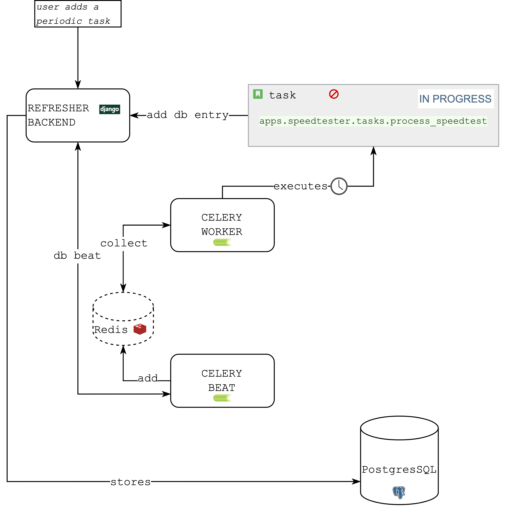
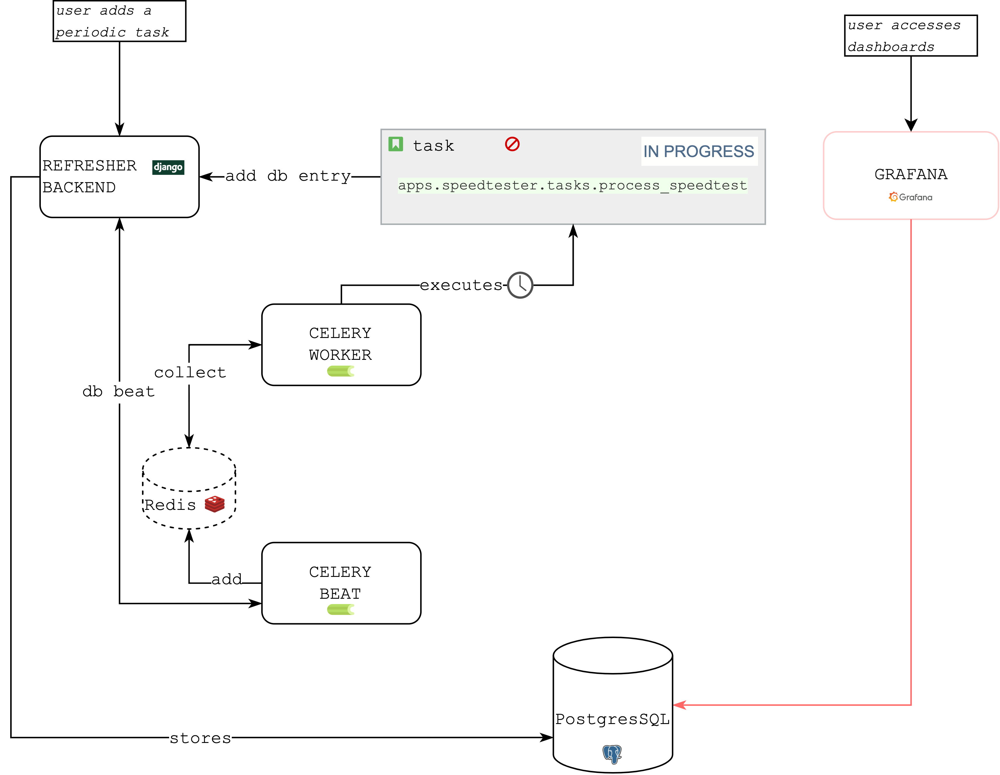
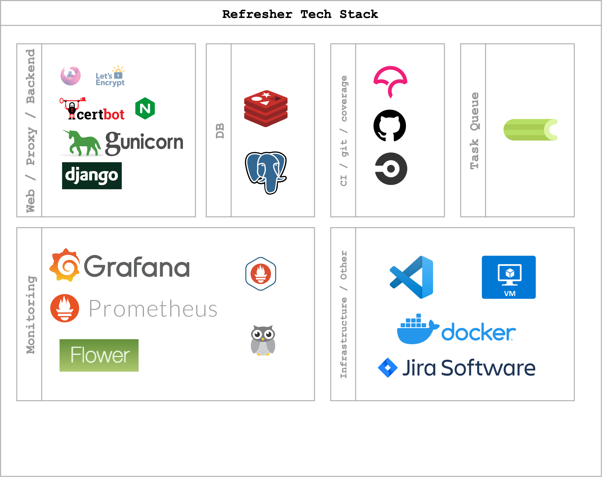
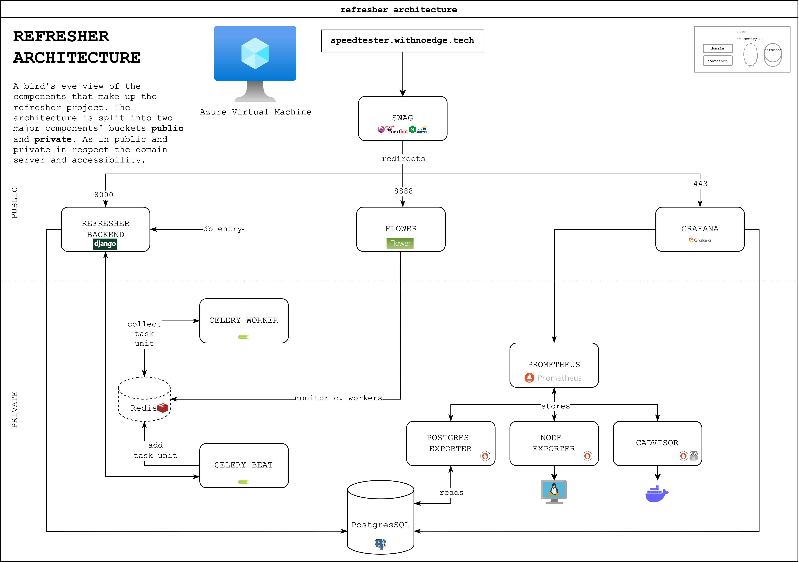

# Refresher
[]()
[]()
[]()
[](https://github.com/ibrahimroshdy/refresher/actions/workflows/docker-image.yml)
[](https://dl.circleci.com/status-badge/redirect/gh/ibrahimroshdy/refresher/tree/main)
[](https://codecov.io/gh/ibrahimroshdy/refresher)

## Introduction
You probably have tons of ideas laying around in some notebook about a specific project you want to start implementing. 
You probably also google the same set of instructions over and over. You always forget some of the syntax in a `Dockerfile`.

Instead, why don't you have a complete project that grows as your experience grows and works as your own technical refresher. 
The Refresher project aims to refresh technical skill and create an environment that is ready for experimenting ideas and expansion. 
Each version of this project should project a design scheme. 
This is refresher v1.

<summary><h4 style="display: inline-block">Table of Contents</h4></summary>
    <ol>
        <li>
            Refresher Project
              <ul>
                <li><a href="#overview">Overview</a></li>
                <li><a href="#refresher-use-case">Refresher Use case</a></li>
              </ul>
        </li>
        <li>
            Technology
              <ul>
                <li><a href="#tech-stack">Tech Stack</a></li>
                <li><a href="#architecture">Architecture</a></li>
                <li><a href="#application-level-road-trip">Application Level Road trip</a></li>
              </ul>
        </li>
        <li>
            Code
              <ul>
                <li><a href="#folder-structure">Folder Structure</a></li>
                <li><a href="#getting-started">Getting Started</a></li>
              </ul>
        </li>
</ol>


---

<details open="open">
  <summary><h2 style="display: inline-block">Refresher Project</h2></summary>

### Overview
Refresher project is a complete infrastructure that embodies different technologies to serve a series of tasks. 
The refresher project aims to create a complete guide in every aspect of those technologies
to serve as a guide or a template for jumpstarting similar projects. 
There is basically no definitive aim for this project, rather than having an educational pipeline that is so complex yet so simple to 
understand in introduction how to develop, stage, release and maintain projects.

#### Refresher Use Case
Imagine you need a cronjob (scheduled) based application that executes specific tasks at 
specific intervals of your choice **and** stores information regarding these tasks (output, logs…etc.). Moreover, you need to monitor these 
tasks in terms of successes and failures. You also need to monitor your system usage, database usage and your docker services (containers) health. 
Finally, you need to visualize all of these, rather than looking at tens of scrambled data in tables, queries on your console. 
After all that, you need to serve your application(s) publicly and securely.

The refresher project is a Django backend using PostgresSQL database with asynchronous task scheduler - celery -  using a Redis broker. 
There is one Django app in the refresher project called **speedtester** app. 
The speedtester app mainly runs internet speedtests every specific interval **using** celery workers 
and stores the `download`, `upload`  speeds and `url` of each test to the PostgresSQL using Django's ORM.
Using celery beat database scheduler, the database now holds information about celery task and defined interval. 
This means you can instruct a specific task written in your backend to run on an interval simply through your admin portal. 

A user adds a periodic task using the **Django** admin portal, this automatically adds the periodic task 
and its defined interval in the designated data tables in the database. 
Celery — Asynchronous Task Scheduler — has two major processes running (celery **worker** and celery **beat**).
Using `django-celery-beat` application, there is an established connection between **Django** and **Celery**, where the 
**Celery Beat** scheduler process is now looking for tasks that are stored in the database. In other words, Django sets 
celery beat to look for scheduled tasks stored in the designated data tables mentioned above. Celery beat then collects those tasks 
and adds them to a broker (**Redis**) — fancy word for an inmemory db. Those tasks in Redis are waiting to be picked up 
by a **Celery Worker** — the responsible process for executing task units. Finally, the task itself — the speedtester unit in this case — 
is executed where it uses `RefresherSpeedtest()` class to perform an internet speed test and 
stores data into a **PostgresSQL** database via **Django's** ORM as a db entry. 
Now the worker marks the task as completed and picks up the next task in line. 



The refresher project now has some basic ideas to build an infrastructure around it.
1. A fully functioning **Django** backend
2. **Asynchronous Task Scheduler** (basically well managed cronjobs)
3. A **PostgresSQL** database

The speedtester collects `download`, `upload`  speeds and `url` of each conducted speedtest
`apps.speedtester.tasks.process_speedtest`. In doing so it also retains a list of the pinged servers' details per 
speedtest for example (country, country code, coordinates).
With all of that saved in a database, it now **needs** — can —  to visualize our data. 


Above, is a [Grafana](https://grafana.com/) dashboard that visuals the data tables of the `speedtester` application.
This can easily be done by connecting Grafana to the database.



</details>

---

<details open="open">
  <summary><h2 style="display: inline-block">Technology </h2></summary>

### Tech Stack 
In this section, the refresher project's tech stack is visualized and explained. 
The tech stack is a chart with all the components and tools used to build this project and
not just technical tools but also project management tools, Continuous Integration (CI), code coverage as well. 



### Architecture
The refresher project V1 runs on a single host machine (virtual machine) to simplify the architecture visualization. 
Running on Azure Compute Virtual Machine and using Docker to run containers. 
In V2 and onwards, refresher project will change its architecture as the project grows.
`Refresher V1` is a monolithical single host project using dockerized containers sharing the same network to serve different purposes. 

>There are so many wrongs here but for a jumpstart option this **can** be considered.




> Well, let's break this down. The refresher project has single subdomain attached to it which is `speedtester.withnoedge.tech`

The [SWAG](https://www.linuxserver.io/blog/2020-08-21-introducing-swag) - Secure Web Application Gateway - 
is a tool that encapsulates tools that are essential for running a secure web application, as it says 
'sets up an Nginx web server and reverse proxy with PHP support and a 
built-in certbot client that automates free SSL server certificate generation and renewal processes'
SWAG has:
1. [Certbot](https://certbot.eff.org/)
2. [NGINX](https://www.nginx.com/)


Basically, there is the main domain name `withnoedge.tech` with a subdomain `speedtester` attached to it, 
so it becomes `speedtester.withnoedge.tech` that *subdomain* now 
links a [*A DNS record*](https://www.cloudflare.com/learning/dns/dns-records/dns-a-record/) to an [Azure Virtual Machine](https://azure.microsoft.com/en-us/services/virtual-machines/#overview)'s *Public IPV4* address. After that, every time you *visit* `speedtester.withnoedge.tech` you will be routed to the Virtual Machine.
> Did you notice the word visit was in italics?

Well, yes. Visiting a domain name (a virtual machine) here needs to identified – or to make this technically correct it needs to be **identified** then **routed**.

### Application Level Road trip
First, you need to identify what are the applications you will need to access from your server
(your virtual machine is a server now!), and [applications](https://www.imperva.com/learn/application-security/osi-model/) 
here are meant to describe the generic usage of tools (HTTP, ssh, telnet…etc.) – *layer 7 in OSI* – for example most of
usage in this project will HTTP(s) requests via a Web Browser. We will also need SSH to access the machine's console securely.

Secondly, you need to route your applications to the ports you 
will be mainly using, for example, by default `HTTPS runs on port 443` and `ssh run on port 22`. 
So simply speaking, having a machine in a local network with `port 22` exposed, you can now use your terminal to
connect to that machine's console and if you have a web server running on `port 9000`, 
you can simply write the local machine's IP in your browser with `port 9000` and **it works**!

Complexly speaking, we are doing the same thing but on a larger scale.

So meanwhile, *SWAG* takes care of distributing, securing and routing of our three main applications. 

1. [Django](https://www.djangoproject.com/) 
2. [Grafana](https://grafana.com/)
3. [Flower](https://flower.readthedocs.io/en/latest/)

</details>

---

<details open="open">
  <summary><h2 style="display: inline-block">Code</h2></summary>


### Folder Structure

```
           __               _               
 _ __ ___ / _|_ __ ___  ___| |__   ___ _ __ 
| '__/ _ \ |_| '__/ _ \/ __| '_ \ / _ \ '__|
| | |  __/  _| | |  __/\__ \ | | |  __/ |   
|_|  \___|_| |_|  \___||___/_| |_|\___|_|   

         ├── README.md # Readme Markdown 
         ├── apps # Django apps
         ├── docker # docker folder (Dockerfile, docker-compose, grafana and prometheus setup)
         ├── images # screenshots
         ├── manage.py 
         ├── nginx # nginx conf files
         ├── pyproject.toml # python packages list using poetry 
         ├── refresher_config # django main configuration app
         ├── requirements.txt # python packages requirements list 
         ├── scripts # shell scripts 
         └── static # static files for django project

```

## Getting Started
1. CI
   1. CircleCI
   2. Github Actions
      1. Workflows
      2. Actions
2. codecov. 


</details>
